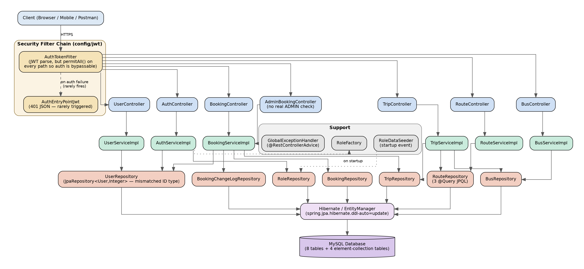
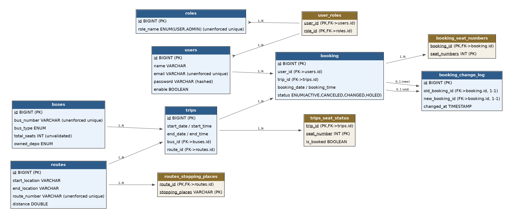
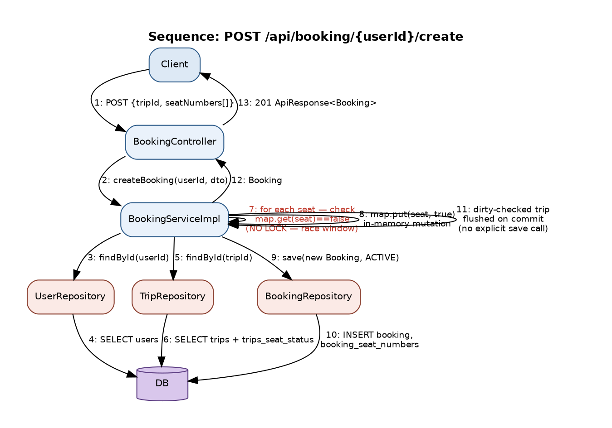

# Technical Analysis — Online Bus Booking System (v1)

> Companion document to the [README](../README.md). This is a full code-level audit of this repository as originally built, including architecture, data model, every endpoint, and a severity-rated issue register. Written to be honest about the project's gaps — most of these are exactly what the [in-progress rebuild](../README.md#-what-im-rebuilding-next) addresses.

**Stack:** Java 21 · Spring Boot 3.4.5 · Spring Web · Spring Data JPA · Spring Security · JWT (`jjwt` 0.11.5) · MySQL · Lombok · Maven
**Package root:** `com.vipusa.bus.booking.system`

> **Methodology note:** No SQL migration files exist in this repository. The database structure documented below is derived from JPA entity mappings (`spring.jpa.hibernate.ddl-auto=update`), not verified against a live database. Security claims are derived from `WebSecurityConfig.java`.

---

## Table of Contents

1. [Architecture](#1-architecture)
2. [Data Model](#2-data-model)
3. [API Reference (42 endpoints)](#3-api-reference-42-endpoints)
4. [Request Flow Example](#4-request-flow-example--booking-creation)
5. [Best Practices Already Present](#5-best-practices-already-present)
6. [Issue & Risk Register](#6-issue--risk-register)
7. [Recommended Remediation Roadmap](#7-recommended-remediation-roadmap)

---

## 1. Architecture

Three-tier layered architecture: **Controller → Service → Repository → Hibernate/EntityManager → MySQL**, with a JWT-based security filter chain in front of the controllers.

| Layer | Responsibility | Observed characteristics |
|---|---|---|
| Security filter chain | JWT parsing, authentication context, 401 handling | `AuthTokenFilter` + `AuthEntryPointJwt` exist but `permitAll()` on every path regex means the entry point almost never fires |
| Controller (7 classes) | HTTP mapping, validation trigger, try/catch error wrapping, response shaping | Error handling duplicated per class instead of centralized; some misnamed methods (e.g. `getBusById` returning a user) |
| Service (6 impl classes) | Business rules, orchestration across repositories | Only `BookingServiceImpl` and `UserServiceImpl` declare `@Transactional` |
| Repository (7 interfaces) | Spring Data derived queries + 3 hand-written JPQL queries | `UserRepository` generic type (`Integer`) mismatches the entity's `Long` id |
| Support | `RoleFactory` (creational), `RoleDataSeeder` (startup data), `GlobalExceptionHandler` (validation only) | Most business exceptions bypass the global handler and surface as raw 500s |
| Persistence | Hibernate ORM over MySQL | `ddl-auto=update` — no versioned migrations |

**Design patterns present:** layered architecture, repository pattern (Spring Data), builder pattern (Lombok, `ApiResponse.builder()`), factory pattern (`RoleFactory`), generic response envelope (`ApiResponse<T>`), stateless JWT auth (HS512, 24h expiry — implemented but not enforced), constructor injection in most services (field injection remains in `AuthServiceImpl`, `WebSecurityConfig`, `RoleFactory`).

---

## 2. Data Model

8 primary tables plus 4 element-collection tables generated by JPA for list/map-valued fields (stopping places, seat status, seat numbers, and the roles join table). All primary keys are `BIGINT` auto-increment. Foreign keys are implicit — no `@JoinColumn` names are specified, so Hibernate derives the join column names.

### Relationship summary

| Relationship | Cardinality | Mapping |
|---|---|---|
| users ↔ roles | Many-to-many | via `user_roles` join table |
| buses → trips | One-to-many | `Trip.bus` `@ManyToOne` |
| routes → trips | One-to-many | `Trip.route` `@ManyToOne` |
| routes → routes_stopping_places | One-to-many | `@ElementCollection` (value type, not an entity) |
| users → booking | One-to-many | `Booking.user` `@ManyToOne` |
| trips → booking | One-to-many | `Booking.trip` `@ManyToOne` |
| trips → trips_seat_status | One-to-many | `@ElementCollection` map (seat number → boolean) |
| booking → booking_seat_numbers | One-to-many | `@ElementCollection` list |
| booking ↔ booking_change_log | Two unidirectional one-to-ones | `oldBooking` / `newBooking` each `@OneToOne`; no reverse mapping on `Booking` |

### Schema-level gaps

- No explicit unique constraints anywhere — `roles.role_name`, `users.email`, `users.name`, `buses.bus_number`, and `routes.route_number` are all queried by value but not constrained, so duplicates are possible.
- No explicit secondary indexes beyond what Hibernate derives for foreign keys.
- `User.id` is `Long`, but `UserRepository extends JpaRepository<User, Integer>` — a mismatched generic, worked around with hand-declared `findById(Long)` / `existsById(Long)` / `deleteById(Long)` overloads.
- Seats and seat numbers are stored as element-collection rows rather than normalized inventory rows, which complicates locking (see Issue #6).

---

## 3. API Reference (42 endpoints)

All responses use the envelope `ApiResponse<T> { isSuccess, message, response }`, except unauthenticated-request errors, which use `AuthEntryPointJwt`'s shape `{ status, error, message, path }`.

> The **Auth req.** column below reflects intended design. The confirmed reality (Issue #1) is that `WebSecurityConfig` applies `permitAll()` to every path shown, so **none of these currently require a token.**

### 3.1 AuthController — `/api/auth`

| # | Method & Route | Purpose | Auth req. | Notes |
|---|---|---|---|---|
| 1 | `POST /signup` | Register a user, return JWT | None | 409 if user exists, 404 if role invalid, 400 on validation failure |
| 2 | `POST /login` | Authenticate, return JWT | None | Unregistered email → unhandled 500; wrong password → 401; `enable` flag is never checked |

### 3.2 BookingController — `/api/booking`

| # | Method & Route | Purpose | Auth req. | Notes |
|---|---|---|---|---|
| 3 | `POST /{userId}/create` | Create booking, mark seats | User | 500 on business-rule failure (raw exception message echoed) |
| 4 | `GET /{bookingId}` | Fetch booking | User | 404 if status is CANCELED |
| 5 | `PUT /{userId}/cancel/{bookingId}` | Cancel booking, free seats | User | Sign-error bug — see Issue #5 |
| 6 | `GET /{userId}/canceledBookings` | List CANCELED bookings | User | — |
| 7 | `GET /{userId}/allBookings/active` | List ACTIVE bookings | User | — |
| 8 | `GET /{userId}/allBookings/hold` | List HOLED bookings | User | HOLED status is never set by any code path — always empty |
| 9 | `GET /{userId}/allBookings/changed` | List CHANGED bookings | User | — |

### 3.3 AdminBookingController — `/api/admin/booking`

| # | Method & Route | Purpose | Auth req. | Notes |
|---|---|---|---|---|
| 10 | `GET /allBookings/{tripId}` | Bookings for a trip | Admin (intended) | No role check enforced |
| 11 | `GET /allBookings/user/{userId}` | All bookings for a user | Admin (intended) | No role check enforced |
| 12 | `PUT /changeBooking/{userId}/{bookingId}` | Change booking → new booking + change log | Admin (intended) | No role check enforced |
| 13 | `GET /allBookings` | All bookings, unpaginated | Admin (intended) | No role check enforced; no pagination |

### 3.4 UserController — `/api/user`

| # | Method & Route | Purpose | Auth req. | Notes |
|---|---|---|---|---|
| 14 | `GET /getAll` | List all users | Admin (intended) | Returns hashed passwords — no `@JsonIgnore` (Issue #3) |
| 15 | `GET /{userId}` | Get user (method misnamed `getBusById`) | User | `orElseThrow()` → 500 if missing |
| 16 | `PUT /editUser/{userId}` | Update name/email | User | Throws `RuntimeException` → 500 on failure |
| 17 | `DELETE /{userId}` | Delete user (method misnamed `deleteBus`) | Admin (intended) | FK violation on users with bookings → 500 |

### 3.5 TripController — `/api/trip`

| # | Method & Route | Purpose | Auth req. | Notes |
|---|---|---|---|---|
| 18 | `POST /create` | Create trip; overlap + 9h-break validation; init seat map | Admin (intended) | No DTO validation — end date can precede start date |
| 19 | `GET /{tripId}` | Get trip | None | 404 via `EntityNotFoundException` |
| 20 | `GET /getAll` | All trips | None | — |
| 21 | `DELETE /{tripId}` | Delete trip | Admin (intended) | FK violation on trips with bookings → 500 |
| 22 | `GET /start/{date}` | Trips starting on a date | None | Returns 404 on success (Issue #4); bad date format → 404 |
| 23 | `GET /end/{date}` | Trips ending on a date | None | Bad date format → 404 |
| 24 | `GET /bus/{busId}` | Trips for a bus | None | Returns 404 on success (Issue #4) |
| 25 | `GET /route/{routeId}` | Trips for a route | None | Returns 404 on success (Issue #4) |
| 26 | `GET /time?startTime=&endTime=` | Trips with startDate between two ISO dates | None | — |

### 3.6 RouteController — `/api/route`

| # | Method & Route | Purpose | Auth req. | Notes |
|---|---|---|---|---|
| 27 | `POST /create` | Create route | Admin (intended) | No DTO validation |
| 28 | `GET /getAll` | All routes | None | — |
| 29 | `GET /{routeId}` | Get route | None | Not-found returns 200 with `isSuccess:false` (inconsistent with #30) |
| 30 | `GET /routeNumber/{routeNumber}` | Route by number | None | Not-found → 404 via `RuntimeException` (inconsistent with #29) |
| 31 | `GET /start/{startPlace}` | Routes by start location | None | — |
| 32 | `GET /end/{endPlace}` | Routes by end location | None | — |
| 33 | `GET /stopping/{place}` | Routes passing a stop | None | In-memory filter over `findAll()` — no query (Issue #10) |
| 34 | `PUT /{routeId}` | Update route | Admin (intended) | No DTO validation |
| 35 | `DELETE /{routeId}` | Delete route | Admin (intended) | FK violation on routes with trips → 500 |

### 3.7 BusController — `/api/bus`

| # | Method & Route | Purpose | Auth req. | Notes |
|---|---|---|---|---|
| 36 | `POST /create` | Create bus | Admin (intended) | `totalSeats` accepts 0/negative — no validation |
| 37 | `GET /{busId}` | Get bus | None | 1-hour `Cache-Control` header |
| 38 | `GET /getAll` | All buses | None | — |
| 39 | `GET /byDepots/{depots}` | Buses by depot (enum) | None | — |
| 40 | `GET /byBusType/{busType}` | Buses by type (enum) | None | — |
| 41 | `PUT /editBus/{busId}` | Update bus | Admin (intended) | No DTO validation |
| 42 | `DELETE /{busId}` | Delete bus | Admin (intended) | FK violation on buses with trips → 500 |

**Request validation coverage:** Bean Validation is present on the sign-up, login, and booking DTOs only. `CreateBusRequest`, `EditBusRequest`, `CreateRouteRequest`, `EditRouteRequest`, `CreateTripRequest`, and `EditUserRequest` carry zero validation annotations.

---

## 4. Request Flow Example — Booking Creation

Trace of `POST /api/booking/{userId}/create`, which also documents the seat-booking race condition (Issue #6):

Seat availability is checked and updated against an in-memory map with no pessimistic lock, optimistic version column, or unique constraint backing it — two concurrent requests for the same seat on the same trip can both succeed.

| Flow | Entry point | Key behavior |
|---|---|---|
| Cancel booking | `PUT /api/booking/{userId}/cancel/{bookingId}` | Ownership checked via `findByIdAndUser_Id`; two time-window checks; a sign error in the ≥3h pre-departure check means cancellation only succeeds *after* departure (Issue #5) |
| Change booking | `PUT /api/admin/booking/changeBooking/{userId}/{bookingId}` | Validates ACTIVE status and ≥3h lead time; frees old seats; creates a new booking; writes a `booking_change_log` row; not actually admin-restricted |
| Create trip | `POST /api/trip/create` | Loads bus and route, checks time overlap plus a 9-hour break rule against the bus's other trips, then seeds the seat map `1..totalSeats = false` |
| Route lookup by stop | `GET /api/route/stopping/{place}` | Loads every route via `findAll()` and filters in Java rather than querying — an unnecessary full table scan |

---

## 5. Best Practices Already Present

Not everything here needs fixing — some things were done right the first time:

- Layered separation with interface–implementation decoupling for services
- Constructor-based dependency injection in most services
- Generic response envelope (`ApiResponse<T>`) for consistent JSON shape
- Bean Validation on the auth and booking request DTOs
- Custom `@RestControllerAdvice` for validation errors
- BCrypt password hashing (passwords are never stored in plaintext)
- Stateless JWT with HS512, 512-bit key enforcement, 24h expiry, and a dedicated filter + entry point
- `@Transactional` on the multi-write booking operations
- SLF4J logging across controllers
- Enums for domain values (roles, bus types, depots, booking status)
- Factory pattern for role resolution, seeder for startup reference data
- `java.time` used throughout for dates

---

## 6. Issue & Risk Register

### 6.1 Critical

| # | Issue | Location | Fix |
|---|---|---|---|
| 1 | All 42 endpoints are reachable without authentication or role checks; `@EnableMethodSecurity` is configured but never exercised | `WebSecurityConfig.java:64–69` | Restrict by rule: keep only `/api/auth/**` public; require authentication elsewhere; add `@PreAuthorize`/`hasRole("ADMIN")` on admin paths; verify the JWT subject matches the `{userId}` path parameter |
| 2 | Database password and JWT signing secret are committed in plain text | `application.properties:5, :11` | Move to environment variables or a git-ignored secrets file; consider a secrets manager |
| 3 | Password hashes are serialized in API responses | `User.java:22`; `GET /api/user/getAll`, `GET /api/user/{userId}` | Add `@JsonIgnore` to the password field; return DTOs/`UserDetailsImpl` instead of the raw entity; disable open-in-view |

### 6.2 High

| # | Issue | Location | Fix |
|---|---|---|---|
| 4 | Successful trip lookups return HTTP 404 instead of 200 | `TripController.java:183, 253, 288` | Return `HttpStatus.OK` on the success path |
| 5 | Cancel-window check has a sign error, making bookings effectively uncancellable before departure | `BookingServiceImpl.java:103–107` | Compute `Duration.between(now, tripStart)` (not the reverse) and require ≥ 3 hours |
| 6 | Seat booking is a read-then-write on an in-memory map with no locking — concurrent requests can double-book a seat | `BookingServiceImpl.java:64–72` | Use `@Lock(PESSIMISTIC_WRITE)`, add a `@Version` column, or normalize seats into dedicated rows with a unique constraint |
| 7 | Seat numbers are not validated for range, duplicates, or bus capacity; `totalSeats` can be 0 or negative | `CreateBookingRequest`, `CreateBusRequest` | Validate `1 ≤ seat ≤ totalSeats`, de-duplicate the request, enforce `@Positive` on `totalSeats` |
| 8 | Deleting a user/bus/route/trip with dependent rows throws an unhandled FK violation → 500 | `UserServiceImpl.deleteUser`, `TripServiceImpl.deleteTrip`, `RouteServiceImpl.deleteRoute`, `BusServiceImpl.deleteBus` | Check for dependents before delete and return 409, or apply a considered cascade strategy |
| 9 | Raw exception messages (SQL errors, class names) are echoed to API callers | `BookingController:50`, `AdminBookingController:57`, and similar | Log full stack traces server-side only; return generic client-safe messages via a central handler |

### 6.3 Medium

| # | Issue | Location | Fix |
|---|---|---|---|
| 10 | Route-by-stopping-place search loads the entire table and filters in Java | `RouteServiceImpl.java:36–49` | Replace with a JPQL/`@Query` match on the collection table; add an index |
| 11 | Inconsistent status-code/error-shape conventions across controllers | Multiple | Adopt one scheme: 404 for missing resource, 400 for bad request, 200/204 for success |
| 12 | `UserRepository` generic type (`Integer`) does not match the entity's `Long` id | `UserRepository.java:10` | Change to `JpaRepository<User, Long>`; remove hand-declared shadow methods |
| 13 | Login bypasses the configured `AuthenticationManager` and does manual password matching, so the `enable` flag is never checked | `AuthServiceImpl`; `WebSecurityConfig:53` (unused bean) | Use `authenticationManager.authenticate(...)`; remove the dead code path |
| 14 | Controllers return raw JPA entities, exposing internal seat maps and collection tables | Multiple controllers | Introduce response DTOs; set `spring.jpa.open-in-view=false` |
| 15 | Business-rule violations surface as generic 500s instead of 4xx | `BookingServiceImpl`, `UserController.getUserById` | Introduce custom domain exceptions with `@ExceptionHandler` mappings |
| 21 | No DB-level unique constraints on `role_name`, `email`, `bus_number`, `route_number` | Entity mappings | Add unique constraints; enforce transactionally |
| 24 | Seats/seat numbers stored as element-collection rows rather than a normalized seat-inventory table | Trip/Booking entity mappings | Model seat inventory as first-class entities |

### 6.4 Low

| # | Issue | Location | Fix |
|---|---|---|---|
| 16 | Redundant CORS configuration: per-controller `@CrossOrigin("*")` plus a global CORS bean, both wide open | `AuthController.java:15`; `WebSecurityConfig` | Remove the per-controller annotation; restrict allowed origins |
| 17 | `BookingStatus.HOLED` naming defect (should be `HELD`); no code path ever sets it | `Bookings.java:36` | Rename the enum value; implement or remove the hold workflow |
| 18 | Trip creation does not validate `endDate ≥ startDate`; overlap logic has edge gaps at exact boundaries | `CreateTripRequest`/`TripServiceImpl` | Add `@AssertTrue`; add boundary tests |
| 19 | Copy-paste naming defects (`getBusById` fetches a user, `deleteBus` deletes a user, a trip-deletion message says "Bus with ID") | `UserController.java:63, :128`; `TripController` | Rename methods and correct messages |
| 20 | `booking_change_log` rows are written but never read by any endpoint | `AdminBookingController.changeBooking` | Add a query endpoint, or remove the write |
| 23 | Unhandled exceptions fall through to the default whitelabel error page | Various | Add a catch-all `@ExceptionHandler(Exception.class)` |

---

## 7. Recommended Remediation Roadmap

**Tier 1 — Critical (do first)**
1. Replace `permitAll()` with a real authorization matrix; add ownership checks tying the JWT subject to path-parameter user IDs
2. Remove hardcoded DB/JWT secrets from `application.properties`
3. Stop serializing password hashes

**Tier 2 — High**
4. Fix the three trip endpoints returning 404 on success
5. Fix the inverted cancel-window duration calculation
6. Add pessimistic locking or a normalized seat-inventory model
7. Validate seat numbers and bus capacity
8. Handle FK-violation deletes gracefully
9. Stop echoing raw exception messages to callers

**Tier 3 — Medium**
10. Introduce Flyway migrations and DB-level unique constraints
11. Fix the `UserRepository` generic type mismatch
12. Route login through `AuthenticationManager`
13. Replace the in-memory route-by-stop filter with JPQL
14. Introduce response DTOs; set `open-in-view=false`
15. Standardize status-code and error-shape conventions

**Tier 4 — Low / Housekeeping**
16. Remove redundant CORS configuration
17. Rename `HOLED` → `HELD`; fix copy-paste naming defects
18. Validate trip end date is after start date
19. Build a consumer for `booking_change_log` or drop the write
20. Add rate limiting on login, pagination, OpenAPI docs, and real test coverage

---

*This analysis reflects the repository as originally built. It has not been re-verified against a live database, deployment environment, or frontend integration.*
